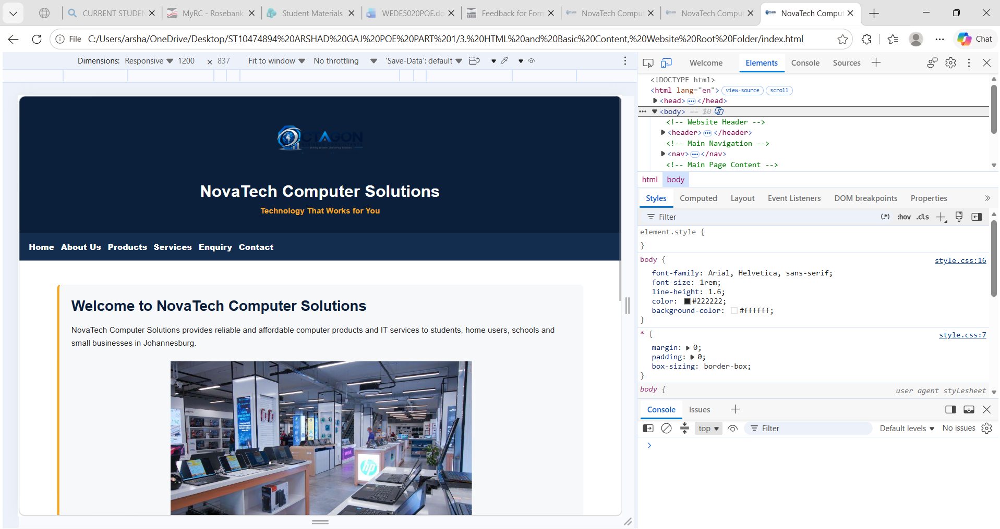
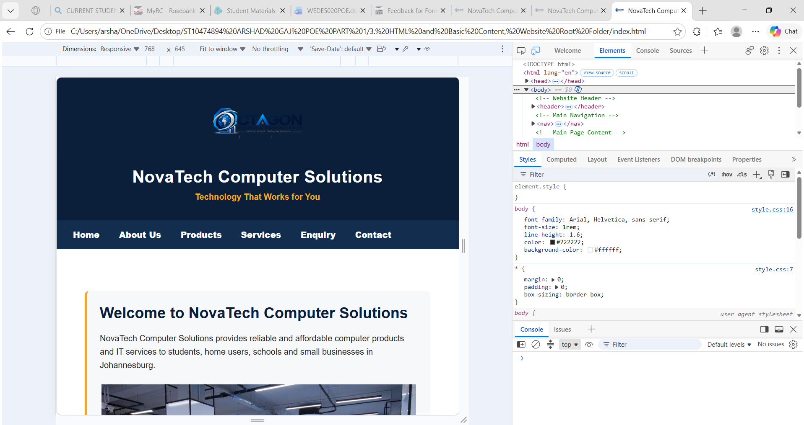
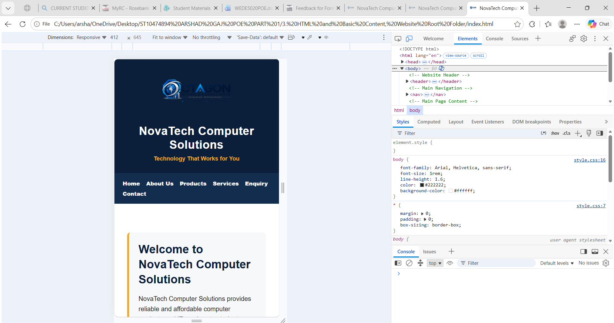

# NovaTech Computer Solutions Website

## Project Overview

NovaTech Computer Solutions is a fictional information technology business based in Johannesburg, Gauteng. This website was developed as part of the WEDE5020 Web Development (Introduction) Portfolio of Evidence.

The purpose of the website is to provide customers with clear and accessible information about NovaTech Computer Solutions, its computer products, IT services and methods of contacting the business.

## Website Pages

The website consists of six interconnected HTML5 pages:

- **Home (`index.html`)** – introduces NovaTech Computer Solutions and provides an overview of the business.
- **About Us (`about.html`)** – provides information about the company, including its mission and vision.
- **Products (`products.html`)** – presents laptops, desktop computers, accessories and other computer products.
- **Services (`services.html`)** – describes the IT services offered, including computer repairs, software installation and technical support.
- **Enquiry (`enquiry.html`)** – provides a form that allows customers to submit enquiries about products and services.
- **Contact (`contact.html`)** – provides contact information, operating hours and other methods of communicating with the business.

## Project Structure

The project is organised into separate folders for different website resources:

- `images/` – stores the images used throughout the website.
- `css/` – stores CSS stylesheets used to style the website.
- `js/` – reserved for JavaScript files that may be introduced during later development.
- HTML files are stored in the main website project folder.

## Technologies Used

The project currently uses:

- HTML5
- CSS3
- Semantic HTML elements
- HTML navigation and hyperlinks
- Responsive images
- CSS Flexbox
- CSS media queries
- HTML forms and required-field validation
- Git and GitHub for version control

## Development and Testing

The website was developed using Visual Studio Code and tested in a web browser. Testing includes checking that:

- All six HTML pages open correctly.
- Navigation links connect to the correct pages.
- Images load correctly.
- Website content displays correctly.
- The Enquiry form accepts user input.
- Required-field validation prevents incomplete form submission.
- Desktop, tablet and mobile layouts respond correctly at different screen sizes.

## Version Control

GitHub is used to store the project and maintain a record of its development. Commits are used to document significant changes made to the website during the development process.

## Author

**Student:** Arshad Gaj  
**Student Number:** ST10474894  
**Module:** WEDE5020 – Web Development (Introduction)  
**Portfolio:** POE Part 2  
**Year:** 2026

## POE Part 2 – CSS Styling and Responsive Design

Part 2 of the project focuses on improving the visual design and responsiveness of the NovaTech Computer Solutions website. An external CSS stylesheet was introduced and applied consistently across all six HTML pages.

The website uses a dark blue, white and orange colour scheme to maintain a professional technology-focused appearance. CSS was used to improve typography, spacing, navigation, page layout, images, forms and other visual elements.

Responsive design was implemented to allow the website to adapt to different screen sizes. Media queries were used for desktop, tablet and mobile layouts. Flexible layouts and responsive images were also implemented to improve the website's usability across different devices.

The website was tested using browser developer tools at different viewport sizes to confirm that the content, navigation, images and page layouts respond correctly.

## Changelog

### Part 1 Feedback Corrections

- **Goals and Objectives:** Added a separate Objectives section to the project documentation. The original project goals were retained, while clear objectives were added to explain what the NovaTech website is intended to achieve.

- **Current Analysis:** Expanded the current analysis to explain NovaTech's existing situation, limitations caused by not having a dedicated website, customer communication challenges, online visibility and how the proposed website addresses these problems.

- **Proposed Website Features and Functionality:** Expanded the proposed features and functionality to provide clearer descriptions of the six website pages and explain how each page supports the needs of NovaTech and its customers.

- **Design Aesthetic:** Improved the design planning by providing a clearer and more consistent visual direction for the website, including the dark blue, white and orange colour scheme, typography, spacing and overall technology-focused appearance.

- **Technical Requirements:** Expanded the technical requirements to provide clearer information about the technologies, software, browser requirements, file structure and resources required to develop and maintain the website.

- **Timeline:** Revised the project timeline to provide a clearer development schedule and more realistic allocation of tasks across the different stages of the website project.

- **Budget:** Expanded the proposed budget to provide clearer estimated costs and explanations for the resources required for the website.

- **Content Research and Sourcing:** Improved the organisation and detail of the content research and sourcing information used to support the website content.

- **Sitemap:** Improved the sitemap documentation to provide a clearer representation of the website structure and relationships between the six website pages.

- **GitHub Commits:** Improved commit descriptions so that changes made during development can be identified more clearly.

- **README and Changelog:** Expanded the README with additional project information and introduced a more detailed changelog to document development changes and Part 1 feedback corrections.

### Part 2 Development Changes

- Created and linked an external CSS stylesheet to provide consistent styling across the website.
- Added a CSS reset to improve consistency between browsers.
- Applied consistent typography, colours, margins, padding and spacing.
- Used Flexbox to improve website layout and navigation.
- Added visual styling including backgrounds, borders and other interface improvements.
- Added interactive styling for navigation links and other interactive elements.
- Implemented responsive layouts using CSS media queries.
- Added desktop, tablet and mobile layout adjustments.
- Used relative and flexible sizing where appropriate to improve responsiveness.
- Implemented responsive images using `srcset` and `sizes`.
- Tested the website at desktop, tablet and mobile viewport sizes using browser developer tools.
- Checked all six pages to confirm that navigation, content, images and layouts display correctly at different screen sizes.

## Changelog

### Part 2 Development

#### Part 1 Feedback Corrections
- Added clear and measurable objectives to the project proposal because the original proposal included goals but did not clearly identify the project objectives.
- Expanded the current analysis to provide a more detailed explanation of NovaTech Computer Solutions' current situation, communication methods, limitations and the need for a dedicated website.
- Expanded the proposed website features and functionality to clearly explain the purpose and functionality of the Home, About Us, Products, Services, Enquiry and Contact pages.
- Improved the design aesthetic description by providing clearer information about the colour scheme, typography, layout and overall visual consistency of the website.
- Expanded the technical requirements to provide clearer information about the software, technologies, browser testing and development requirements.
- Improved the project timeline by providing clearer development activities and realistic time allocation.
- Expanded the proposed budget to provide clearer cost estimates and justification.
- Improved the organisation and detail of the content research and sourcing information.
- Improved the sitemap information to provide a clearer representation of the website structure.

#### CSS Styling
- Created an external CSS stylesheet named `style.css`.
- Linked the external stylesheet to all six HTML pages.
- Added a CSS reset to provide consistent browser styling.
- Added consistent typography, spacing, colours, borders and layout styling.
- Used the NovaTech dark blue, white and orange colour scheme throughout the website.
- Added interactive hover, focus and active states for navigation links and form controls.

#### Responsive Design
- Added responsive styling for desktop, tablet and mobile screen sizes.
- Used media queries to adapt the website layout at different breakpoints.
- Used relative sizing and responsive layouts to improve usability on different devices.
- Added responsive image handling using `srcset` and `sizes`.
- Tested the website using browser developer tools at desktop, tablet and mobile widths.
- Added screenshot evidence of responsive testing.

#### Responsive Testing Evidence

**Desktop - 1200 px**

**Tablet - 768 px**

**Mobile - 412 px**

 